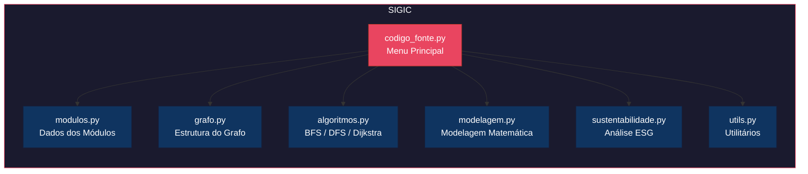

#  SIGIC - Sistema Inteligente de Gerenciamento da Infraestrutura da Colônia

## Sobre o Projeto

O **SIGIC** (Sistema Inteligente de Gerenciamento da Infraestrutura da Colônia) é uma aplicação Python desenvolvida para modelar, gerenciar e otimizar a infraestrutura da colônia marciana **Aurora Siger**.

O sistema representa a colônia como uma rede interconectada (grafo) de módulos essenciais, utilizando estruturas de dados, algoritmos de busca e caminhos mínimos, modelagem matemática de consumo energético, e governança ESG para garantir a sustentabilidade e sobrevivência da base.

## Diagrama de Arquitetura



## Requisitos e Instalação

O projeto central utiliza Python puro e bibliotecas nativas (como `os` e `math`), porém, para o carregamento dinâmico de dados a partir de arquivos CSV, o projeto requer a biblioteca **Pandas**.

Para instalar as dependências necessárias, execute:

```bash
# Clone o repositório
git clone https://github.com/luizduarte/fase4_grupo9.git

# Acesse o diretório
cd fase4_grupo9

# Crie um ambiente virtual (opcional, mas recomendado)
python3 -m venv venv
source venv/bin/activate  # ou venv\Scripts\activate no Windows

# Instale o pandas
pip install pandas

# Execute o sistema
python3 main.py
```

## Estrutura de Dados (Carregamento via CSV)

As informações dos módulos e suas conexões na colônia são carregadas dinamicamente através de arquivos CSV localizados na pasta `data/`:
- **`modulos.csv`**: Define as propriedades dos módulos, como id, nome, consumo energético, armazenamento, entre outros.
- **`conexoes.csv`**: Estabelece os enlaces (arestas do grafo) entre cada módulo indicando a distância em metros.

Essa abordagem com `pandas` substitui os dados "hardcoded", garantindo maior flexibilidade e facilitando a simulação de novos cenários sem alterar o código principal.

## Funcionalidades Principais

O menu interativo apresenta as seguintes funcionalidades:

1. **Visualizar rede da colônia**: Exibe o diagrama simplificado das conexões entre módulos.
2. **Consultar módulos**: Lista dados, prioridades e consumo de cada setor.
3. **Exibir matriz de adjacência**: Mostra a representação tabular das conexões.
4. **Exibir lista de adjacência**: Mostra os vizinhos diretos de cada módulo.
5. **Busca em Largura (BFS)**: Explora a rede por níveis de profundidade, verificando a conectividade.
6. **Busca em Profundidade (DFS)**: Percorre a rede a fundo, identificando eventuais ciclos.
7. **Caminho Mínimo (Dijkstra)**: Calcula a rota mais eficiente para transferência de recursos.
8. **Detectar Conexões Críticas**: Encontra "pontos de articulação" que, se falharem, isolam partes da base.
9. **Analisar Eficiência da Rede**: Calcula métricas como densidade, diâmetro e grau médio.
10. **Modelagem Matemática (Consumo)**: Modela o crescimento exponencial do consumo via derivadas numéricas.
11. **Modelagem Matemática (Perda)**: Analisa a perda de energia em conexões via gradiente descendente.
12. **Simulação de Emergência**: Aplica regras ESG para manter a base viva sob escassez.
13. **Relatório ESG Completo**: Avalia uso sustentável, governança tecnológica e otimização.
14. **Simular Expansão**: Adiciona um módulo e mensura o impacto no consumo e nas conexões.
