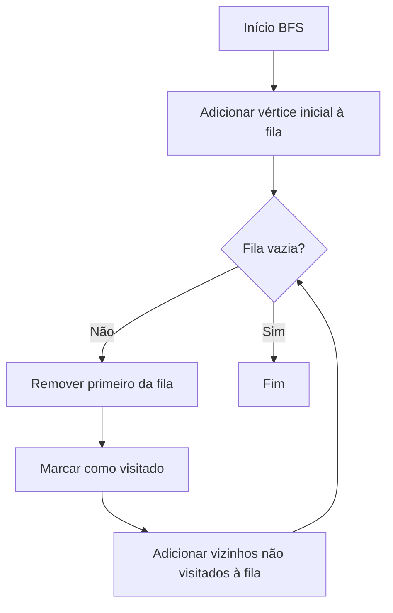

# Documentação Complementar - SIGIC

Este documento expande os detalhes técnicos e as justificativas sobre as estruturas e algoritmos implementados no **Sistema Inteligente de Gerenciamento da Infraestrutura da Colônia (SIGIC)**.

## 1. Justificativa das Estruturas de Dados Escolhidas

Conforme exigido pelo Capítulo 2 e as orientações do projeto, o sistema utiliza diversas estruturas fundamentais de Python para armazenar informações:

1. **Dicionários (Dicts):** Utilizados para representar os atributos dos **Módulos**. A escolha por dicionários se deve à clareza semântica: atributos podem ser acessados por chave, como `modulo["consumo_energetico"]`, garantindo flexibilidade e facilidade de leitura. Além disso, foram usados em listas de adjacências (`dict` de listas).
2. **Tuplas:** Empregadas na propriedade `prioridade` dos módulos (ex.: `(5, "Crítica")`). Tuplas são imutáveis e mais eficientes em memória. A prioridade de um sistema vital é um dado de projeto inalterável, portanto o uso da tupla blinda contra alterações acidentais.
3. **Listas (Vetores):** São a base estrutural. Guardam todos os dicionários (lista de módulos), formam as Filas e Pilhas (usadas nos algoritmos BFS/DFS), e compõem a matriz de adjacência (lista de listas).
4. **Matrizes (Lista de Listas):** Utilizadas para a representação da **Matriz de Adjacência** do grafo, permitindo consultar conexões em complexidade O(1) com as chamadas `matriz[i][j]`.

### 1.1. Ingestão de Dados (CSV e Pandas)

Para conferir escalabilidade e manter as melhores práticas de Engenharia de Software, o SIGIC não emprega dados *hardcoded* no código fonte. Todos os dados relativos aos módulos e conexões físicas da colônia são centralizados no diretório `data/`:
- `data/modulos.csv`: armazena as entidades primárias e suas propriedades estruturais.
- `data/conexoes.csv`: armazena as rotas e distâncias, determinando as arestas do grafo.

A biblioteca **Pandas** é utilizada exclusivamente durante a fase de inicialização do sistema (`main.py`) para ler os arquivos CSV estruturando os DataFrames. Logo após a leitura, os DataFrames são iterados e transformados nos tipos nativos de Python (Listas, Tuplas e Dicionários) mencionados anteriormente. Esse design garante flexibilidade ao alimentar os dados e preserva a pureza lógica dos algoritmos do sistema.

---

## 2. Modelagem do Grafo da Rede

O modelo construído é um **Grafo Não-Direcionado Ponderado**:
- O grafo possui **8 Vértices** representando cada módulo (ex.: Habitação, Centro de Controle, etc).
- Possui **10 Arestas**, configuradas com pesos que representam a **distância em metros** entre os módulos.
- Mantemos simultaneamente a matriz de adjacência (ideal para checagem rápida de arestas) e a lista de adjacência (ideal para iteração sobre vizinhos).

---

## 3. Algoritmos Implementados

### 3.1. Busca em Largura (BFS)

Usada para exploração sistemática da rede "nível a nível". Útil para validar se a colônia está **conexa** (todos os módulos acessíveis a partir da Habitação).

### 3.2. Busca em Profundidade (DFS)

Avança pelas conexões de um ramo até o fim antes de retroceder. Foi implementada com o uso de **pilha** (`append()` e `pop()`) explícita, ideal para analisar dependências encadeadas e auxiliar na detecção de caminhos críticos/ciclos.

### 3.3. Algoritmo de Dijkstra

Calcula o caminho mínimo (a rota menos custosa em metros) entre um módulo A e B. Na infraestrutura da Aurora, serve para otimizar as **rotas de envio de energia ou oxigênio**, mitigando perdas de distribuição ao escolher o trajeto mais curto.

---

## 4. Modelagem Matemática

A modelagem matemática aborda dois problemas centrais para a viabilidade da colônia: o crescimento exponencial e a perda energética.

### 4.1. Fenômeno de Crescimento (Consumo Energético)
**Fórmula:** `C(t) = C₀ · e^(k·t)`
*   `C₀`: Consumo basal total medido (kWh)
*   `k`: Taxa de expansão da colônia
*   `t`: Tempo em meses.

Foi calculada a **derivada** desta função (Taxa de Variação) via **diferenças finitas**:
`C'(t) ≈ [C(t+h) - C(t-h)] / 2h`
Essa análise determina em que mês a demanda sobrecarregará os módulos de geração se nenhuma atitude for tomada.

### 4.2. Fenômeno de Perda na Distribuição
**Fórmula:** `P(d) = P₀ · (1 - e^(-α·d))`
*   `P₀`: Perda energética máxima assintótica.
*   `α`: Constante de atenuação natural dos cabos de transmissão em Marte.
*   `d`: Distância do cabo de transmissão.

Utilizamos **otimização (gradiente descendente 1D)** para identificar o limite de distância para que as perdas sejam menores ou iguais a 10%, demonstrando onde será necessário criar subestações de armazenamento ao longo da colônia.

---

## 5. Sustentabilidade e ESG

O pilar de Governança Ambiental, Social e Corporativa (ESG) foi implementado via lógica de simulação em `sustentabilidade.py`:
*   **Gestão Ambiental:** Relatório detalhado das perdas em cada linha de transmissão e simulação do impacto sustentável (aumento de demanda) da implementação de um novo módulo (ex: Reciclagem).
*   **Responsabilidade Social (Sobrevivência):** Ao detectar estado de emergência (corte de energia para 60%), o sistema executa um balanceamento automatizado priorizando **suporte médico** e **habitação**, diminuindo ou cortando acesso a módulos de pesquisa e agricultura, garantindo que os habitantes de Aurora não fiquem sem suporte de vida.
*   **Governança Responsável:** O sistema fornece dados acionáveis ("Pontos Críticos" na rede) embasando decisões gerenciais (como expansão de cabos e redundância da infraestrutura).
