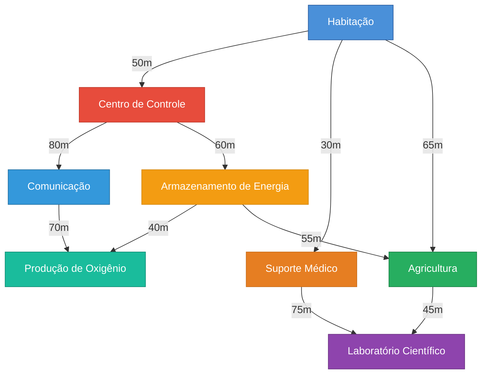

# Rede da Colônia Aurora Siger

```mermaid
graph TD
    HAB[" Habitação"] -->|50m| CC[" Centro de Controle"]
    HAB -->|30m| MED[" Suporte Médico"]
    CC -->|80m| COM[" Comunicação"]
    CC -->|60m| ARM[" Armazenamento de Energia"]
    COM -->|70m| O2[" Produção de Oxigênio"]
    ARM -->|40m| O2
    ARM -->|55m| AGR[" Agricultura"]
    AGR -->|45m| LAB[" Laboratório Científico"]
    HAB -->|65m| AGR
    MED -->|75m| LAB

    style HAB fill:#4a90d9,stroke:#2c5ea0,color:#fff
    style CC fill:#e74c3c,stroke:#c0392b,color:#fff
    style ARM fill:#f39c12,stroke:#d68910,color:#fff
    style AGR fill:#27ae60,stroke:#1e8449,color:#fff
    style LAB fill:#8e44ad,stroke:#6c3483,color:#fff
    style COM fill:#3498db,stroke:#2471a3,color:#fff
    style MED fill:#e67e22,stroke:#ca6f1e,color:#fff
    style O2 fill:#1abc9c,stroke:#148f77,color:#fff
```
